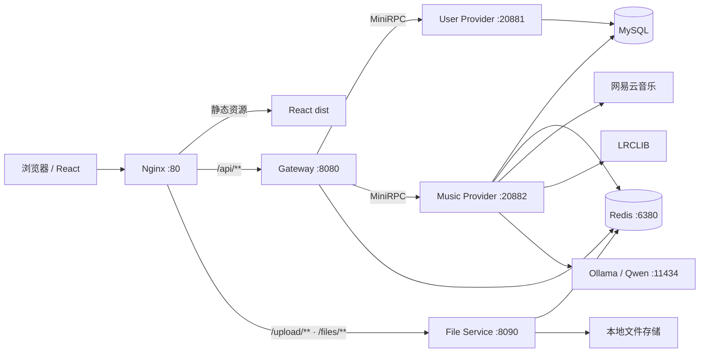

# AveMusic

## 项目简介

基于 **Spring Boot、React 与自研 MiniRPC** 构建的分布式音乐平台，覆盖用户认证、角色权限、音乐内容管理、审核发布、歌单收藏、在线播放、播放统计、文件上传与歌词 AI 增强等完整业务链路。

项目采用 Gateway、用户服务、音乐服务与文件服务分离的模块化架构：业务服务通过基于 Netty 的 MiniRPC 通信，MySQL 保存核心数据，Redis 管理登录会话、上传凭证和播放心跳；歌词能力接入网易云音乐、LRCLIB 与本地 Ollama/Qwen，在不影响基础播放功能的前提下完成歌词匹配、消歧和逐行翻译。

## 核心特性

- **自研 MiniRPC：** 基于 Netty 实现服务发布与引用、动态代理、序列化与压缩、超时控制、业务异常映射以及 TLS/mTLS 安全传输，并通过 Spring Boot Starter 完成 Provider/Consumer 自动装配。
- **完整认证会话：** 使用 Access Token、Refresh Token 与 Redis Session 组合管理登录状态，使 JWT 保持无状态传递能力的同时支持主动失效。
- **五级 RBAC 权限：** 支持 `SUPER_ADMIN`、`OPERATOR`、`REVIEWER`、`ARTIST`、`USER` 五类角色及细粒度 authorities；角色变更时同时失效目标用户的全部旧 Session，避免旧 Token 残留权限。
- **音乐内容闭环：** 支持音乐、专辑、音乐人、歌单、收藏、内容审核、在线播放与后台管理等核心业务。
- **可信播放统计：** 通过 `playSession + Redis Heartbeat` 累计有效播放时长，达到有效播放条件后才计入播放量，降低拖动进度或重复请求造成的误计。
- **多源歌词匹配：** 聚合网易云音乐与 LRCLIB 候选，根据歌曲名、音乐人及别名、专辑和时长进行本地评分；低置信场景交由 Qwen 进行候选消歧。
- **本地 AI 歌词翻译：** 通过 Ollama 调用 Qwen 逐行翻译歌词，使用批量请求、JSON Schema 结构化输出、行数校验和数据库缓存提升稳定性；AI 服务异常时保留原歌词展示。
- **独立文件服务：** 音频、专辑封面、头像和歌单封面由 File Service 处理；浏览器携带一次性 Upload Ticket 直传，避免大文件经过 Gateway 二次转发。

## 技术栈

| 分类 | 技术 |
| --- | --- |
| 前端 | React、TypeScript、Vite、Axios |
| Web 与安全 | Spring Boot、Spring MVC、Spring Security、JWT |
| 服务通信 | 自研 MiniRPC、Netty、动态代理、TLS/mTLS |
| 数据访问 | MySQL、MyBatis-Plus |
| 缓存与状态 | Redis |
| AI 与歌词 | Ollama、Qwen、网易云音乐歌词源、LRCLIB |
| 文件与统一入口 | 独立 File Service、Nginx |
| 构建工具 | Maven、npm |

## 整体架构



统一入口下的请求分工如下：

| 路径 | 目标 | 说明 |
| --- | --- | --- |
| `/` | React 静态站点 | 页面与前端路由 |
| `/api/**` | Gateway | 认证、权限和业务 API |
| `/upload/**` | File Service | 携带 Upload Ticket 的文件直传 |
| `/files/**` | File Service | 图片与音频资源访问 |

## 模块结构

以下为逻辑结构示意；如果仓库使用聚合目录，请以实际目录层级为准。

```text
AveMusic/
├─ avemusic-gateway/          # HTTP API、Spring Security、Session 与 RPC Consumer
├─ avemusic-user-api/         # 用户服务 RPC 接口及 DTO
├─ avemusic-user-provider/    # 注册登录、用户资料、角色与权限数据
├─ avemusic-music-api/        # 音乐服务 RPC 接口及 DTO
├─ avemusic-music-provider/   # 音乐业务、审核、播放统计、歌词与 AI
├─ avemusic-file-service/     # Upload Ticket 校验、文件保存与资源读取
├─ minirpc-*/                 # 自研 MiniRPC 核心、传输及 Starter 等模块
└─ avemusic-web/              # React + TypeScript 前端
```

## 核心设计亮点

### 1. 自研 MiniRPC

Gateway 不直接依赖 Provider 的实现，而是通过 RPC API 模块共享服务契约。Consumer 基于动态代理发起调用，Provider 负责服务暴露；Netty 承担网络传输，框架统一处理序列化、压缩、超时、业务异常与 TLS/mTLS。Spring Boot Starter 将服务引用、服务发布和相关配置纳入自动装配，减少业务模块中的通信样板代码。

### 2. JWT + Redis Session

JWT 用于携带用户身份、角色和 authorities，Redis Session 保存当前会话是否仍然有效。每次受保护请求除校验 JWT 外，还会确认对应 Session 存在，因此退出登录、刷新令牌异常或管理员主动失效会话后，旧 JWT 不能继续单独使用。

系统同时维护用户到多个 Session 的反向索引：

```text
auth:session:{sessionId}          -> 会话数据
auth:user-sessions:{userId}      -> 当前用户的 sessionId 集合
```

当超级管理员调整其他用户角色时，Provider 会再次读取数据库校验操作人角色，并禁止修改自己的角色；更新成功后 Gateway 批量删除目标用户的全部 Session，使新角色与新权限只能在重新登录后生效。

### 3. RBAC 权限控制

角色用于表达用户类型，authorities 用于控制具体操作。Gateway 通过 Spring Security 完成入口鉴权，关键管理操作在 Provider 中再次做业务级校验，避免仅依赖前端显示状态或单层接口权限。

### 4. 多源歌词匹配与 Qwen 消歧

歌词查询优先读取本地数据库缓存；未命中时并行考虑网易云音乐和 LRCLIB 候选，再根据标题、音乐人及别名、专辑、歌曲时长等信息进行本地评分。只有在候选接近、规则难以稳定判断时才调用 Qwen，并对模型返回的候选 ID 和置信度继续做业务校验，AI 不直接创造数据库事实。

### 5. Ollama + Qwen 歌词翻译

翻译只处理已经匹配成功的原歌词，不让模型生成原歌词。服务从同步歌词或纯文本歌词中提取有效行，分批调用本地 Ollama，并使用 JSON Schema 约束返回结构；解析后检查输出行数与输入行数是否一致，完整结果写入 `translation_json`，后续请求直接读取缓存。模型不可用或输出不合法时，基础歌词与播放链路仍可继续工作。

### 6. 播放防刷

播放开始时创建 `playSession`，播放过程中由前端持续发送 Heartbeat。Redis 记录会话状态和累计有效时长，后端在满足有效播放条件后才增加播放次数，并避免同一播放会话重复计数。统计依据是真实播放过程，而不是单次“开始播放”请求。

### 7. 独立文件服务

业务端先鉴权并签发一次性 Upload Ticket，前端随后将文件直接上传到 File Service。File Service 从 Redis 原子读取并消费 Ticket，校验文件分类和大小后保存文件，再返回资源地址。上传链路不经过 Gateway，既减少内存与网络转发压力，也让业务 API 与大文件传输职责保持分离。

## 关键业务流程

### 登录与令牌刷新

```text
登录请求
  -> User Provider 校验账号
  -> Gateway 创建 Redis Session
  -> 签发 Access Token + Refresh Token
  -> 请求携带 Access Token
  -> JWT 校验 + Redis Session 校验
  -> Access Token 过期后使用 Refresh Token 换取新令牌
```

### 管理员修改用户角色

```text
SUPER_ADMIN 提交角色修改
  -> Gateway 校验 sys::admin authority
  -> 从 Authentication 获取真实操作人 ID
  -> MiniRPC 调用 User Provider
  -> Provider 查询数据库并再次确认操作人为 SUPER_ADMIN
  -> 禁止修改自己，更新目标用户角色
  -> Gateway 删除目标用户全部 Redis Session
  -> 目标用户重新登录后获得新角色与 authorities
```

### 文件上传

```text
前端向 Gateway 申请 Upload Ticket
  -> Gateway 完成业务鉴权并将 Ticket 写入 Redis
  -> 前端 POST /upload/files/{category}
  -> 请求携带 X-Upload-Ticket
  -> File Service 校验并消费一次性 Ticket
  -> 保存文件并返回 /files/** 资源地址
```

### 歌词匹配与翻译

```text
查询本地歌词缓存
  -> 未命中：网易云音乐 + LRCLIB 搜索
  -> 本地规则评分
  -> 低置信候选交给 Qwen 消歧
  -> 校验候选并持久化原歌词
  -> 按需调用 Ollama/Qwen 逐行翻译
  -> 校验结构与行数
  -> 保存 translation_json
```

### 有效播放统计

```text
创建 playSession
  -> 播放期间持续 Heartbeat
  -> Redis 累计有效播放时长
  -> 达到有效条件后计数
  -> 标记该会话已计数，避免重复增加
```

## 运行环境与端口

### 环境要求

- JDK：使用项目 `pom.xml` 声明的编译版本
- Maven：使用项目 Maven Wrapper；若仓库未包含 Wrapper，则安装兼容版本的 Maven
- Node.js / npm：使用前端 `package.json` 或锁文件要求的版本
- MySQL
- Redis（当前本地配置端口为 `6380`）
- Ollama 与 `qwen3.5:9b`（需要启用 AI 歌词能力时）
- Nginx（推荐作为统一入口；仅本地前端开发时可暂不使用）

### 默认端口

| 服务 | 端口 | 备注 |
| --- | ---: | --- |
| Nginx | `80` | 前端、API、上传与资源统一入口 |
| Vite Dev Server | `5173` | 仅前端开发模式 |
| Gateway | `8080` | HTTP 业务 API |
| File Service | `8090` | 文件上传与资源访问 |
| User Provider | `20881` | MiniRPC Provider |
| Music Provider | `20882` | MiniRPC Provider |
| Redis | `6380` | Session、Ticket、Heartbeat 等 |
| MySQL | `3306` | 若本机使用其他端口，请修改数据源配置 |
| Ollama | `11434` | 本地模型 API |

> 端口可通过各模块配置覆盖；修改 Provider 端口时，需要同步更新对应的 RPC Consumer 配置。

## 快速启动

### 1. 准备基础服务

启动 MySQL 与 Redis，并创建 AveMusic 使用的数据库。数据库账号、密码与库名应写入本地配置，初始化表结构请使用仓库内现有 SQL 脚本。

需要歌词 AI 功能时，启动 Ollama 并准备模型：

```bash
ollama pull qwen3.5:9b
ollama serve
```

### 2. 配置本地环境

建议使用不提交到 Git 的本地配置文件或环境变量保存数据库密码、Redis 密码、JWT 密钥等敏感信息。下面仅展示核心连接项，字段值请按本机环境替换：

```yaml
spring:
  datasource:
    url: jdbc:mysql://127.0.0.1:3306/<database>?useUnicode=true&characterEncoding=utf8&serverTimezone=Asia/Shanghai
    username: <mysql-username>
    password: <mysql-password>
  data:
    redis:
      host: 127.0.0.1
      port: 6380
      password: <redis-password>

avemusic:
  ai:
    ollama:
      base-url: http://127.0.0.1:11434
      model: qwen3.5:9b
```

File Service 对外地址可通过当前配置支持的环境变量覆盖：

```powershell
$env:AVEMUSIC_FILE_PUBLIC_BASE_URL = "http://127.0.0.1"
```

通过 Nginx 统一访问时，资源地址应指向统一入口，而不是直接写成 `localhost:8090`。生产或公网环境中请替换为实际 HTTPS 域名。

### 3. 启动后端模块

先启动 Provider，再启动 File Service 和 Gateway：

```text
1. User Provider     :20881
2. Music Provider    :20882
3. File Service      :8090
4. Gateway           :8080
```

如果后端位于同一个 Maven 聚合工程，可在父工程目录分别执行：

```bash
./mvnw -pl avemusic-user-provider -am spring-boot:run
./mvnw -pl avemusic-music-provider -am spring-boot:run
./mvnw -pl avemusic-file-service -am spring-boot:run
./mvnw -pl avemusic-gateway -am spring-boot:run
```

Windows 下可将 `./mvnw` 替换为 `mvnw.cmd`。如果仓库未包含 Maven Wrapper，则使用 `mvn`；也可以直接在 IDE 中按上述顺序启动各模块的 Spring Boot Application。

### 4. 启动前端

```bash
cd avemusic-web
npm install
npm run dev
```

开发模式默认访问：

```text
http://127.0.0.1:5173
```

前端 API 建议使用相对路径 `/api`，上传与文件访问分别使用 `/upload`、`/files`，避免将本机端口硬编码到业务代码。

### 5. 使用 Nginx 统一接入（推荐）

构建前端：

```bash
npm run build
```

然后由 Nginx 提供 `dist` 静态资源，并按以下规则转发：

```nginx
location /api/ {
    proxy_pass http://127.0.0.1:8080;
}

location /upload/ {
    proxy_pass http://127.0.0.1:8090;
    client_max_body_size 350m;
    proxy_request_buffering off;
    proxy_buffering off;
}

location /files/ {
    proxy_pass http://127.0.0.1:8090;
    proxy_set_header Range $http_range;
    proxy_set_header If-Range $http_if_range;
    proxy_buffering off;
}
```

Nginx 的静态目录应指向前端构建生成的 `dist`，并为 React Router 配置 `try_files $uri $uri/ /index.html`。完成后通过 `http://127.0.0.1` 访问项目。

## 配置注意事项

- 不要将数据库密码、Redis 密码、JWT 密钥或公网凭证提交到仓库。
- Gateway 与 File Service 必须连接同一个 Redis 实例和 database，否则 Upload Ticket 无法被正确读取。
- Upload Ticket 为一次性凭证；上传失败后重新尝试时应重新申请。
- 前端不要直接把 JWT 发送给 File Service 代替 Upload Ticket。
- Ollama 不可用时应保留原歌词展示，不应阻断音乐查询和播放。
- 新原歌词替换后应清理旧的 `translation_json`，避免继续展示过期翻译。
- Nginx 转发 `/upload/**` 和 `/files/**` 时应保留原始路径；`proxy_pass` 末尾不要额外添加 `/`。
- File Service 与 Nginx 的文件大小限制、上传超时需要保持一致。

## 后续规划

- 完善 MiniRPC 的调用指标、链路日志与故障诊断能力。
- 补充认证权限、角色变更、Upload Ticket、播放防刷和歌词处理链路的自动化测试。
- 在现有 Qwen 能力上扩展自然语言搜歌、歌曲标签、歌词主题分析和 AI 歌单建议。
- 抽象文件存储接口，在保留本地存储的同时为对象存储实现预留扩展点。
- 优化歌词候选评分、模型失败重试及翻译任务的异步处理体验。
- 丰富播放历史、用户偏好与推荐能力，同时保持推荐决策由业务数据和规则约束。

---

AveMusic 的核心目标不是简单堆叠音乐网站功能，而是在完整业务闭环中实践 RPC 通信、动态权限、会话治理、可信统计、大文件直传和本地大模型增强等工程设计。
